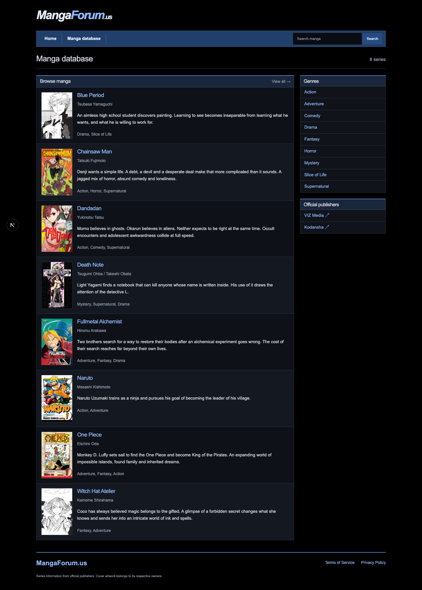
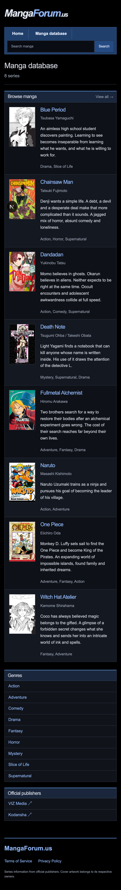

# MangaForum.us

A manga community being built around chapters, personal reading progress and spoiler-aware discussion. The current Phase 1 slice is a public manga catalog: browse and filter titles, view series metadata, inspect chapter histories and find official editions. No scans are hosted.

## Architecture

Browser → Next.js → Spring Boot → PostgreSQL

Next.js 16, TypeScript, Tailwind CSS and TanStack Query render the catalog. Server Components load overview pages; TanStack Query handles interactive discovery. Next.js forwards browser `/api` requests to Spring Boot, which owns persistence, validation and business logic. Java 21, Spring Security, JPA and Flyway form a modular monolith. PostgreSQL constraints enforce unique chapter numbers, follows and reading progress records.

The foundational User, Manga, Chapter, MangaFollow and UserMangaProgress entities exist. Account creation and mutations are deliberately not exposed yet. Public access is limited to catalog GET endpoints and API documentation; CSRF protection remains enabled.

## Local setup

Run the whole application from the repository root:

```sh
npm --prefix frontend ci
npm run dev
```

Requires Node 22+, Java 21+, Maven 3.9+, and PostgreSQL command-line tools. On Apple Silicon Macs the launcher detects Homebrew’s JDK. It starts or reuses a local PostgreSQL instance on port 55432, applies database migrations through Spring Boot, waits for the API, then starts Next.js at http://localhost:3000. Backend logs are in `.local/backend.log`. A newly initialized database persists in `.local/postgres`; stopping the application leaves PostgreSQL running. Set `DATABASE_URL`, `DATABASE_USER`, and `DATABASE_PASSWORD` to use another database.

Starting only `frontend/npm run dev` does not start the API. Use the root command to avoid the catalog connection error.

Alternatively, with Docker installed:

```sh
docker compose up --build
```

Compose serves the frontend at http://localhost:3000, the API at http://localhost:8080/api/manga, and Swagger at http://localhost:8080/swagger-ui/index.html. Its PostgreSQL volume persists across restarts.

The default database contains eight real manga series with author details, original short synopses, genres, and official publisher links. Cover thumbnails and metadata sources are recorded in [catalog sources](docs/catalog-sources.md). This is a curated catalog, not a live release feed. V3 removes the exact synthetic chapter records from the historical V2 demo migration; it does not fabricate replacement chapter dates. V2’s SQL is unchanged and now lives in the common migration directory so existing databases retain a valid migration history.

## Configuration

| Variable | Default | Purpose |
| --- | --- | --- |
| DATABASE_URL | jdbc:postgresql://localhost:5432/mangaforum | Backend JDBC connection |
| DATABASE_USER | mangaforum | Database user |
| DATABASE_PASSWORD | local-development-only | Local database password; replace for deployment |
| BACKEND_URL | http://localhost:8080 | Next.js server and API proxy destination |
| COOKIE_SECURE | false | Set `true` behind HTTPS before accounts launch |

Next.js rewrites are configured at build time. Rebuild the frontend when changing its backend destination. Compose builds with `http://backend:8080` and uses the same address at runtime. Ports are bound to loopback for local use.

## Testing

```sh
cd backend
mvn verify
```

JUnit integration tests use Testcontainers and PostgreSQL 17, requiring a running Docker daemon. They exercise migrations, catalog filters, chapter ordering and invalid requests. They fail rather than silently skip when Docker is unavailable.

```sh
cd frontend
npm ci
npm run build
npm run typecheck
```

GitHub Actions runs the backend integration tests and frontend build. Playwright tests cover discovery, manga pages, chapter lists, empty searches and missing titles at desktop and mobile sizes. With the backend and frontend running:

```sh
cd frontend
npx playwright install chromium
npm run test:e2e
```

Verified locally against PostgreSQL 15: the V2-to-V3 migration and JPA validation. The production Webpack build and TypeScript checks pass. Default Turbopack compilation is blocked by this workspace's local-port restrictions; use `npm run build -- --webpack` here. Docker Compose and Testcontainers still require verification on a machine with Docker.




## Next milestones

1. Verify Phase 1 locally with Docker and in a browser.
2. Session-based authentication, profiles, follows and persisted reading progress.
3. Chapter discussions, replies and restrained reactions.
4. Backend spoiler filtering: future-chapter content must be omitted from responses until a reader is eligible or explicitly reveals it. Blurring alone is insufficient. Apply the same rules to previews, search and real-time events.
5. Redis rate limiting, caching, then Spring WebSocket updates.
6. Redis Streams chapter publication jobs and follower notifications.
7. PostgreSQL full-text search, reports and moderation.

No microservices, external search engine, recommendation ML, or object storage are needed for the current slice. Terms and privacy pages describe the actual catalog-stage service and must be updated before accepting accounts.
